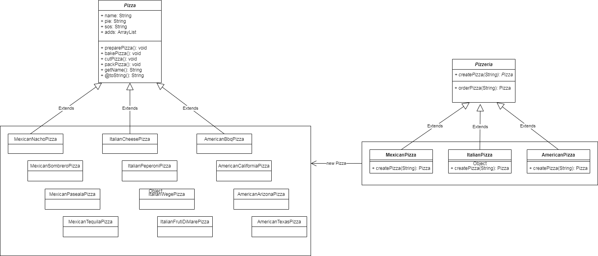

## Design pattern: Factory Method
Factory Method pattern is a design pattern that allows
to create objects, but what is important, subclases 
decide how this object 'll be created and looks like.
Design Pattern Factory delegates responsibility for 
creating objects to subclasses.

## Table of contents
* [General info](#general-info)
* [Technologies](#technologies)
* [Setup](#setup)

## General info
This project is inspired by:
* Chapter 4 from:
Eric Freeman, Elisabeth Freeman, Bert Bates, Kathy Sierra
2017 Head First Design Patterns
* https://refactoring.guru/design-patterns/factory-method - more knowledge 


## Technologies
Project is created with:
* Gradle
* JAVA 15.0.1.
* draw.io

## Setup
To run this project, install it locally using:

```
$ 
$ FORK from git
$ 
```
